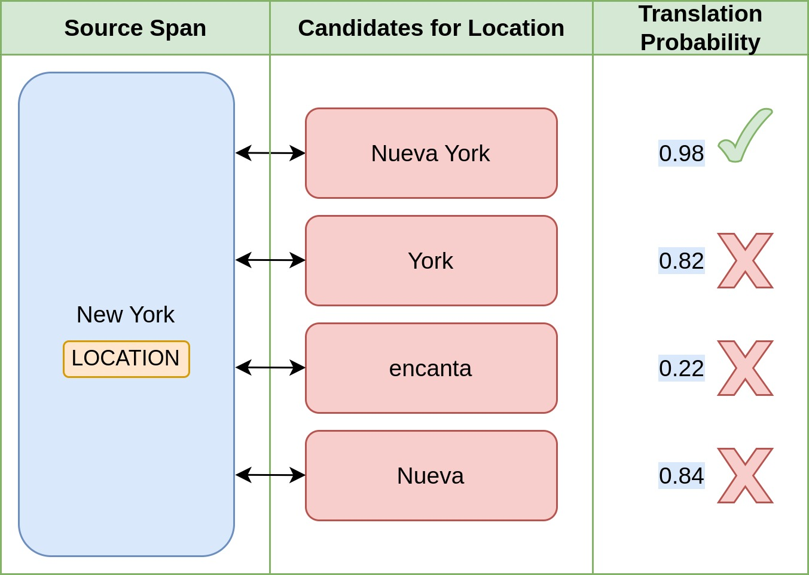

<p align="center">
    <br>
    
    <h2 align="center"><i>High Quality Annotation Projection for Sequence Labeling Tasks</i></h2>


<p align="center">
    <a href="https://twitter.com/intent/tweet?text=Check+out+T-Projection:&url=https%3A%2F%2Fgithub.com%2Fikergarcia1996%2FT-Projection"></a>
    <a href="https://github.com/ikergarcia1996/T-Projection/blob/main/LICENSE"></a>
    <a href="https://huggingface.co/docs/transformers/index"></a>
    <a href="https://huggingface.co/docs/accelerate/index/"></a>
    <a href="https://visitor-badge.laobi.icu/badge?page_id=ikergarcia1996.tprojection"></a>
    <a href="https://arxiv.org/abs/2212.10548"></a>
<br>
     <a href="http://www.hitz.eus/"></a>
    <a href="http://www.ixa.eus/?language=en"></a>
    <a href="https://ikergarcia1996.github.io/Iker-Garcia-Ferrero/"></a>
    <br>
     <br>
</p>


<p align="center">
    <br>
    
</p>

We present T-Projection, a novel approach for annotation projection that leverages large pretrained text2text language models and state-of-the-art machine translation technology. Projection decomposes the label projection task into two subtasks: (i) A candidate generation step, in which a set of projection candidates using a multilingual T5 model is generated and, (ii) a candidate selection step, in which the generated candidates are ranked based on translation probabilities. 


T-Projection can automatically generate data for languages in which manually annotated data is not available 🎉.


Here is an overview of T-Projection. Given the annotated source sentence "I love `New York`," where `New York` is a location, and its Spanish translation "Me encanta Nueva York," T-Projection successfully labels the Spanish sentence! 🚀

For more information, please refer to our Findings of the EMNLP 2023 paper: [T-Projection: High Quality Annotation Projection for Sequence Labeling Tasks](https://arxiv.org/abs/2212.10548).

<p align="center">
    <br>
    
</p>

## Performance


The following graph show the F1 scored achieved by different annotation projection methods from English to other languages compared with human annotation projections. T-Projection is close to human performance on all the tasks 🤯

<p align="center">
    <br>
    
</p>

## Installation


You need to install the following dependencies to run T-Projection:

```bash
Pytorch | https://pytorch.org/get-started | pip install torch
We recommend that you install the 2.1.0 version or newer, but older versions might work as well.

transformers | pip install transformers

accelerate | pip install accelerate

fairseq (AdaFactor Optimizer) | pip install fairseq

NMTScorer | pip install git+https://github.com/ikergarcia1996/nmtscore.git
We use a sightly modified version of NMTScorer to compute the translation probabilities. 
This modification allows to load any M2M100 or NLLB200 model, but does not change how the scores are computed.
Please, check the original repository and give some ❤️love❤️ to the authors : https://github.com/ZurichNLP/nmtscore

seqeval | pip install seqeval

wandb | pip install wandb
```


You can install all the dependencies by running the following command:

```bash
pip install torch transformers accelerate fairseq sequeval wandb git+https://github.com/ikergarcia1996/nmtscore.git
```

# Usage

T-Projection is divided into three steps: (i) Candidate generation, (ii) Candidate selection and (iii) Annotation Projection. 

To run the annotation projection you will need two input files. 
- The source language file, in .conll format with the original sentences and the labels, please, see the [datasets/test_data/en.europarl.conll](datasets/test_data/en.europarl.conll) file for an example.
- The target language translations, in .conll format. If you don't have the target language labels, you can use "O" for all the words. Please see the [datasets/test_data/es.europarl.conll](datasets/test_data/es.europarl.conll) file for an example. If you want to automatically translate your source sentences, please check the Easy-Translate project. This is the easiest way to translate your sentences: https://github.com/ikergarcia1996/Easy-Translate


You can check the examples in the [examples/](examples/) folder to see how to run T-Projection for different tasks and datasets.

## Candidate Generation


<p align="center">
    <br>
    
</p>

In this step, we will use mT5 to generate projection candidates for each entity in the source sentence. A projection candidate is a span of text in the target sentence that corresponds to the source entity. 

```bash
accelerate launch --mixed_precision bf16 seq2seq_t5.py \
--train_tsv datasets/data/en.conll.train.dev.test.tsv \
--dev_tsv datasets/data/en.conll.test.tsv \
--test_source_tsv \
  datasets/data/en.europarl.test.tsv \
  datasets/data/en.europarl.test.tsv \
  datasets/data/en.europarl.test.tsv \
--test_target_tsv \
  datasets/data/es.europarl.test.tsv \
  datasets/data/de.europarl.test.tsv \
  datasets/data/it.europarl.test.tsv \
--num_beams 15 \
--num_return_sequences 15 \
--model_name_or_path google/mt5-xl \
--per_device_train_batch_size 8 \
--per_device_eval_batch_size 1 \
--per_device_test_batch_size 1 \
--gradient_accumulation_steps 1 \
--learning_rate 1e-4 \
--num_train_epochs 4 \
--output_dir results/europarl/ \
--seed 42 \
--eval_every 1 \
--max_source_length 256 \
--max_target_length 256 \
--lr_scheduler_type cosine \
--num_warmup_steps 500 \
--project_name "T5NMTS"
```

- **train_tsv**: The training tsv in the source language. For this example, we use the CoNLL03 English dataset (we concatenate the train, dev and test sets).
- **dev_tsv**: The development tsv in the source language. For this example, we use the CoNLL03 English dataset (we use English test set).
- **test_source_tsv**: The test tsv in the source language. This is the source dataset that we want to project into the target languages. For this example, we use the [Europarl English dataset](https://github.com/ixa-ehu/ner-evaluation-corpus-europarl)
- **test_target_tsv**: The target sentences in tsv format (They can all have the O label). For this example, we use the [Europarl Spanish, German and Italian datasets](https://github.com/ixa-ehu/ner-evaluation-corpus-europarl)
- **num_beams**: The number of beams to use in the beam search. In the paper we generate 100 candidates for each source sentence. As shown in Appendix A (https://arxiv.org/abs/2212.10548), this is excessive, 15-25 candidates is enough.
- **num_return_sequences**: The number of candidates to return for each source sentence. Must be lower or equal to num_beams.
- **model_name_or_path**: The name of the pretrained model to use. `google/mt5-xl` gets the best results, but is very slow and requires a lot of VRAM. `google/mt5-large gets competitive results and is faster and requires less VRAM.
- **per_device_train_batch_size**: We use 8 in all our experiments. If you do not have enough VRAM, you can set it to 1 and set the `--gradient_accumulation_steps` parameter to 8.
- **num_train_epochs**: We use 4 for CoNLL03, for smaller datasets you can increase it (We use 10 for the ABSA datasets).
- **output_dir**: The directory where the model and the predictions will be saved.
- **project_name**: The name of the wandb project for logging.

You can use multiple GPUs by setting the `--num_processes` parameter:

For more info about accelerate see: https://huggingface.co/docs/accelerate/index

```bash
accelerate launch --num_processes 2 --mixed_precision  bf16 seq2seq_t5.py \
[...]
```

This step will produce a jsonl file with the source sentences, the target sentences and the projection candidates. 
See the [datasets/test_data/mt5-large/en2es.europarl.jsonl](datasets/test_data/mt5-large/en2es.europarl.jsonl) file for an example.


## Candidate Selection

<p align="center">
    <br>
    
</p>

In this step, we will score the candidates generated in the previous step using a pretrained NMT model. We will use the translation probabilities computed by NMTScore to rank the candidates. 
For more info about NMTscore read the [paper](https://aclanthology.org/2022.findings-emnlp.15/) and check the [GitHub repository](https://github.com/ZurichNLP/nmtscore).

```bash
#M2M100 Example

  python3 calculate_scores_nmts.py \
  --jsonl_path results/europarl/es.europarl.test.jsonl \
  --model_name_or_path facebook/m2m100-12B-last-ckpt \
  --output_path results/europarl/m2m100-12B.en2es.test.json \
  --source_lang en \
  --target_lang es \
  --normalize \
  --both_directions
  
# NLLB200 EXAMPLE:
  python3 calculate_scores_nmts.py \
  --jsonl_path results/europarl/es.europarl.test.jsonl \
  --model_name_or_path facebook/nllb-200-3.3B \
  --output_path results/europarl/nllb200-3.3B.en2es.test.json \
  --source_lang eng_Latn \
  --target_lang spa_Latn \
  --normalize \
  --both_directions
```

- **jsonl_path**: The path to the jsonl file generated in the previous step.
- **model_name_or_path**: The name of the pretrained model to use. We use `facebook/m2m100-12B-last-ckpt` in the paper, but you can use any M2M100 or NLLB200 model. As shown in Appendix B (https://arxiv.org/abs/2212.10548), the model size does not have a big impact on the results. Thefore you can use `facebook/m2m100_418M`, `facebook/m2m100_1.2B`, `facebook/nllb-200-1.3B`, `facebook/nllb-200-3.3B`
- **source_lang and target_lang**: The source and target language ids. You can check the available language/ids for M2M100 and NLLB200 here: https://github.com/ikergarcia1996/Easy-Translate/blob/main/supported_languages.md
- **normalize and both_directions**: Please, read the NMTScore paper to understand what these parameters do: https://aclanthology.org/2022.findings-emnlp.15/

This step will produce a json dictionary with the source entities, and the score for each projection candidate.  See the [datasets/test_data/mt5-large/en2es.europarl.json](datasets/test_data/mt5-large/en2es.europarl.json) file for an example.

# Annotation Projection

Finally, we use the output from the previous steps to project the annotations. This last step will only take a few seconds and use very little compute resources.

```bash
  python3 label_projection.py \
  --jsonl_path results/europarl/es.europarl.test.jsonl \
  --dictionary_path results/europarl/m2m100-12B.en2es.test.json \
  --output_path results/europarl/en2es.test.tsv
```

If you have a gold target language dataset, you can use it to evaluate the annotation projections.
```bash
  python3 label_projection.py \
  --jsonl_path results/europarl/es.europarl.test.jsonl \
  --dictionary_path results/europarl/m2m100-12B.en2es.test.json \
  --output_path results/europarl/en2es.test.tsv \
  --gold_tsv datasets/data/es.europarl.test.tsv
```

See the [datasets/masakhaNER_projections](datasets/masakhaNER_projections) folder for an example of the projections generated by T-Projection.
# Agglutinative Languages

For agglutinative languages such as Igbo, Hausa... we have a special flag ```--agglutinative_language```. Given the following sentence: _Ummeli waseJamani kwikomiti yezilwanyana yeManyano yaseYurophu..._ 
and the following Location: ['Jamanai']. We will annotate waseJamani as Location. If the flag is not set, we will consider Jamanai as an hallucination and we will discard it. You must set the flag in both, the candidate selection and annotation projection steps.


```bash
# 2) Compute translation probabilities for each candidate
  python3 calculate_scores_nmts.py \
  --jsonl_path results/masakhaner/xho.masakhaner.test.jsonl \
  --model_name_or_path facebook/nllb-200-3.3B \
  --output_path results/masakhaner/nllb200-3.3B.en2xho.test.json \
  --source_lang eng_Latn \
  --target_lang xho_Latn \
  --normalize \
  --both_directions \
  --agglutinative_language
  
# 3) Label projection

  python3 label_projection.py \
  --jsonl_path results/masakhaner/xho.masakhaner.test.jsonl \
  --dictionary_path results/masakhaner/nllb200-3.3B.en2xho.test.json \
  --output_path results/masakhaner/en2xho.test.tsv  \
  --agglutinative_language
```


# Citation

If you use T-Projection please cite the following paper:
```bibtex
@misc{garcíaferrero2023tprojection,
      title={T-Projection: High Quality Annotation Projection for Sequence Labeling Tasks}, 
      author={Iker García-Ferrero and Rodrigo Agerri and German Rigau},
      year={2023},
      eprint={2212.10548},
      archivePrefix={arXiv},
      primaryClass={cs.CL}
}
```

You should also consider citing NMTScore and MT5:
    
```bibtex
@inproceedings{vamvas-sennrich-2022-nmtscore,
    title = "{NMTS}core: A Multilingual Analysis of Translation-based Text Similarity Measures",
    author = "Vamvas, Jannis  and
      Sennrich, Rico",
    editor = "Goldberg, Yoav  and
      Kozareva, Zornitsa  and
      Zhang, Yue",
    booktitle = "Findings of the Association for Computational Linguistics: EMNLP 2022",
    month = dec,
    year = "2022",
    address = "Abu Dhabi, United Arab Emirates",
    publisher = "Association for Computational Linguistics",
    url = "https://aclanthology.org/2022.findings-emnlp.15",
    doi = "10.18653/v1/2022.findings-emnlp.15",
    pages = "198--213",
}
```

```bibtex
@inproceedings{xue-etal-2021-mt5,
    title = "m{T}5: A Massively Multilingual Pre-trained Text-to-Text Transformer",
    author = "Xue, Linting  and
      Constant, Noah  and
      Roberts, Adam  and
      Kale, Mihir  and
      Al-Rfou, Rami  and
      Siddhant, Aditya  and
      Barua, Aditya  and
      Raffel, Colin",
    editor = "Toutanova, Kristina  and
      Rumshisky, Anna  and
      Zettlemoyer, Luke  and
      Hakkani-Tur, Dilek  and
      Beltagy, Iz  and
      Bethard, Steven  and
      Cotterell, Ryan  and
      Chakraborty, Tanmoy  and
      Zhou, Yichao",
    booktitle = "Proceedings of the 2021 Conference of the North American Chapter of the Association for Computational Linguistics: Human Language Technologies",
    month = jun,
    year = "2021",
    address = "Online",
    publisher = "Association for Computational Linguistics",
    url = "https://aclanthology.org/2021.naacl-main.41",
    doi = "10.18653/v1/2021.naacl-main.41",
    pages = "483--498",
}
```