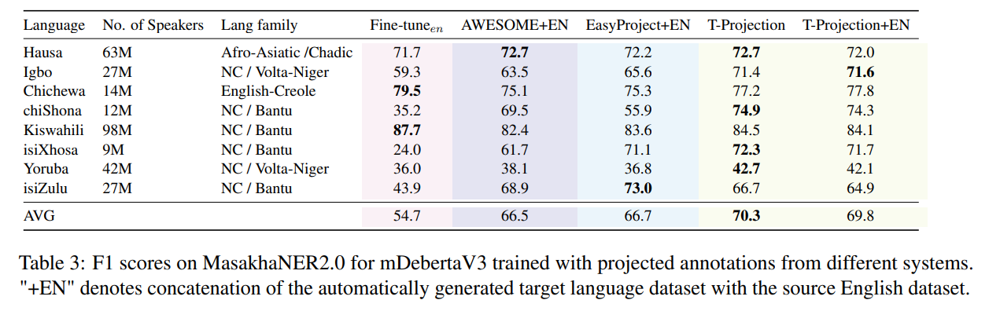

# MasakhaNER Projections

This repository contains the CoNLL2003 translation and projections that we use in our MasakhaNER2.0 experiment.
For more info, read Section 6: https://arxiv.org/abs/2212.10548

     
    

